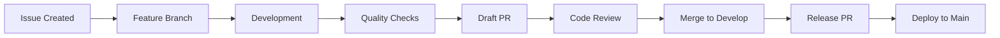

# Code-Guardian Best Practices Guide

## 📋 Table of Contents

1. [Development Workflow](#development-workflow)
2. [Code Quality Standards](#code-quality-standards)
3. [Git Workflow](#git-workflow)
4. [Security Practices](#security-practices)
5. [CI/CD Pipeline](#cicd-pipeline)
6. [Release Management](#release-management)
7. [Documentation Standards](#documentation-standards)
8. [Agent-Based Development](#agent-based-development)
9. [Performance Guidelines](#performance-guidelines)
10. [Compliance & Governance](#compliance--governance)

---

## 🚀 Development Workflow

### Feature Development Process



### 1. Issue-Driven Development

**Create Issues First:**
```bash
# Create issue via GitHub CLI
gh issue create \
  --title "feat: add pattern detection for XYZ" \
  --body "Description of the feature" \
  --label "enhancement,core"
```

**Use Issue Templates:**
- 🐛 **Bug Report**: Structured bug reporting with environment details
- ✨ **Feature Request**: Comprehensive feature specification
- 📚 **Documentation**: Documentation improvements

### 2. Branch Strategy

**Git-Flow Implementation:**
```bash
# Main branches
main      # Production-ready code only
develop   # Integration branch for features

# Supporting branches
feature/* # New features (from develop)
release/* # Release preparation (from develop)
hotfix/*  # Critical fixes (from main)
```

**Branch Naming Convention:**
```bash
feature/issue-123-add-pattern-detection
fix/issue-456-memory-leak-scanner
docs/update-api-documentation
refactor/cleanup-core-module
```

### 3. Development Environment Setup

**Prerequisites:**
```bash
# Install Rust toolchain
curl --proto '=https' --tlsv1.2 -sSf https://sh.rustup.rs | sh
rustup component add clippy rustfmt

# Install additional tools
cargo install cargo-audit cargo-deny cargo-llvm-cov
cargo install --locked cargo-outdated cargo-tree

# Install GitHub CLI
gh --version  # Verify installation
gh auth login # Authenticate
```

**Development Loop:**
```bash
# 1. Sync with develop
git checkout develop
git pull origin develop

# 2. Create feature branch
git checkout -b feature/your-feature

# 3. Development cycle
cargo check     # Fast compilation check
cargo test      # Run tests
cargo clippy    # Linting
cargo fmt       # Formatting

# 4. Commit frequently
git add .
git commit -m "feat: implement pattern detection"

# 5. Push and create draft PR
git push -u origin feature/your-feature
gh pr create --draft --base develop
```

---

## 🎯 Code Quality Standards

### Rust Code Guidelines

**1. Formatting & Style:**
```rust
// Use rustfmt with project configuration
// 4-space indentation, 100 character lines
cargo fmt

// Follow Rust naming conventions
fn scan_directory() {}      // snake_case functions
struct PatternDetector {}   // PascalCase types
const MAX_FILE_SIZE: usize = 1024; // SCREAMING_SNAKE_CASE constants
```

**2. Error Handling:**
```rust
// Use Result<T, E> for fallible operations
use anyhow::{Result, Context};
use thiserror::Error;

#[derive(Error, Debug)]
pub enum ScanError {
    #[error("File not found: {path}")]
    FileNotFound { path: String },
    #[error("Permission denied")]
    PermissionDenied,
}

fn scan_file(path: &Path) -> Result<ScanResults> {
    std::fs::read_to_string(path)
        .with_context(|| format!("Failed to read file: {}", path.display()))?;
    // ... implementation
    Ok(results)
}
```

**3. Documentation:**
```rust
/// Scans a directory for code patterns
/// 
/// # Arguments
/// 
/// * `path` - The directory path to scan
/// * `config` - Configuration for the scan
/// 
/// # Examples
/// 
/// ```
/// use code_guardian_core::scan_directory;
/// let results = scan_directory("./src", &config)?;
/// ```
/// 
/// # Errors
/// 
/// Returns `ScanError` if the directory cannot be accessed
pub fn scan_directory(path: &Path, config: &Config) -> Result<ScanResults> {
    // Implementation
}
```

**4. Testing Standards:**
```rust
#[cfg(test)]
mod tests {
    use super::*;
    use tempfile::TempDir;
    
    #[test]
    fn test_pattern_detection() {
        // Arrange
        let temp_dir = TempDir::new().unwrap();
        let test_file = temp_dir.path().join("test.js");
        std::fs::write(&test_file, "console.log('debug');").unwrap();
        
        // Act
        let results = scan_file(&test_file).unwrap();
        
        // Assert
        assert_eq!(results.matches.len(), 1);
        assert_eq!(results.matches[0].pattern, "ConsoleLog");
    }
    
    #[test]
    fn test_error_handling() {
        let result = scan_file(Path::new("/nonexistent"));
        assert!(result.is_err());
    }
}
```

### Quality Metrics

**Coverage Targets:**
- **Unit Tests**: 80%+ line coverage
- **Integration Tests**: All public APIs
- **Documentation Tests**: All public functions

**Performance Benchmarks:**
```rust
// Use criterion for benchmarking
use criterion::{black_box, criterion_group, criterion_main, Criterion};

fn benchmark_scanner(c: &mut Criterion) {
    c.bench_function("scan large file", |b| {
        b.iter(|| scan_file(black_box(&large_test_file)))
    });
}

criterion_group!(benches, benchmark_scanner);
criterion_main!(benches);
```

---

## 🔀 Git Workflow

### Commit Message Standards

**Conventional Commits Format:**
```
<type>[optional scope]: <description>

[optional body]

[optional footer(s)]
```

**Types:**
- `feat`: New features
- `fix`: Bug fixes
- `docs`: Documentation changes
- `style`: Code formatting
- `refactor`: Code refactoring
- `perf`: Performance improvements
- `test`: Test additions/changes
- `chore`: Maintenance tasks
- `ci`: CI/CD changes

**Examples:**
```bash
feat(core): add support for custom pattern detection
fix(cli): resolve memory leak in file scanner
docs: update API documentation for v0.2.0
perf(scanner): optimize regex compilation for large files
test(storage): add integration tests for database migrations
```

### Branch Protection Rules

**Main Branch Protection:**
```yaml
Required Status Checks:
  - Test (ubuntu-latest, stable)
  - Test (windows-latest, stable)  
  - Test (macos-latest, stable)
  - Coverage
  - Security Audit
  - CodeQL Analysis (rust)
  - CodeQL Analysis (javascript)

Review Requirements:
  - 1 approving review from code owners
  - Dismiss stale reviews on push
  - Require review from code owners
  - Require last push approval

Additional Rules:
  - Require linear history
  - No force pushes
  - No deletions
  - Require conversation resolution
```

**Develop Branch Protection:**
```yaml
Required Status Checks:
  - Test (ubuntu-latest, stable)
  - Coverage
  - Security Audit

Review Requirements:
  - 1 approving review
  - Dismiss stale reviews on push

Additional Rules:
  - Allow force pushes (for rebasing)
  - Require conversation resolution
```

### Merge Strategies

**Feature → Develop:**
```bash
# Use merge commits for traceability
gh pr merge --merge

# Or use rebase for linear history
gh pr merge --rebase
```

**Develop → Main (Releases):**
```bash
# Always use merge commits for releases
gh pr merge --merge
```

---

## 🔒 Security Practices

### Security Scanning Pipeline

**Automated Security Checks:**
1. **cargo-audit**: Vulnerability scanning
2. **CodeQL**: Static analysis
3. **Semgrep**: Security pattern detection
4. **cargo-deny**: License and dependency validation
5. **Dependabot**: Automated dependency updates

**Security Configuration:**
```toml
# deny.toml - Supply chain security
[licenses]
allow = ["MIT", "Apache-2.0", "BSD-2-Clause", "BSD-3-Clause"]
deny = ["GPL-2.0", "GPL-3.0", "AGPL-1.0", "AGPL-3.0"]

[advisories]
vulnerability = "deny"
unmaintained = "warn"
yanked = "deny"

[bans]
multiple-versions = "warn"
wildcards = "deny"
```

### Secure Coding Practices

**Input Validation:**
```rust
// Validate file paths to prevent directory traversal
fn validate_path(path: &Path) -> Result<()> {
    let canonical = path.canonicalize()
        .context("Failed to canonicalize path")?;
    
    if !canonical.starts_with(&base_directory) {
        return Err(anyhow!("Path outside allowed directory"));
    }
    
    Ok(())
}
```

**Resource Limits:**
```rust
// Prevent resource exhaustion
const MAX_FILE_SIZE: u64 = 10 * 1024 * 1024; // 10MB
const MAX_SCAN_DEPTH: usize = 100;

fn scan_with_limits(path: &Path) -> Result<()> {
    let metadata = path.metadata()?;
    if metadata.len() > MAX_FILE_SIZE {
        return Err(anyhow!("File too large"));
    }
    // Continue with scan
}
```

**Secrets Management:**
```rust
// Never hardcode secrets
fn get_api_key() -> Result<String> {
    std::env::var("API_KEY")
        .context("API_KEY environment variable not set")
}
```

---

## 🚀 CI/CD Pipeline

### Workflow Structure

**1. Continuous Integration (.github/workflows/ci.yml):**
```yaml
# Triggers: push to main/develop, PRs to main
Jobs:
  - Format Check (cargo fmt --check)
  - Linting (cargo clippy)
  - Multi-platform Testing (Ubuntu, Windows, macOS)
  - Documentation Tests
  - Code Coverage
  - Security Audit
```

**2. Security Scanning (.github/workflows/security.yml):**
```yaml
# Triggers: push, PR, daily schedule
Jobs:
  - cargo-audit (vulnerability scanning)
  - CodeQL Analysis (static analysis)
  - Semgrep (security patterns)
  - Supply Chain Security (cargo-deny)
  - Dependency Review (for PRs)
```

**3. Performance Testing (.github/workflows/performance.yml):**
```yaml
# Triggers: push to main, weekly schedule
Jobs:
  - Benchmarking (criterion)
  - Memory Profiling (valgrind)
  - Load Testing (large datasets)
  - Performance Regression Detection
```

**4. Release Automation (.github/workflows/release-please.yml):**
```yaml
# Triggers: push to main
Jobs:
  - Create Release PR (release-please)
  - Build Multi-platform Binaries
  - Publish to crates.io
  - Update Documentation
  - Create GitHub Release
```

### Quality Gates

**All commits must pass:**
```bash
✅ cargo fmt --check      # Code formatting
✅ cargo clippy           # Linting (warnings as errors)
✅ cargo test             # All tests pass
✅ cargo test --doc       # Documentation tests
✅ cargo audit            # Security vulnerabilities
✅ cargo build --release  # Release build succeeds
```

**PRs require additional checks:**
```bash
✅ Multi-platform compatibility
✅ Code coverage maintenance
✅ Security scan passes
✅ Performance regression check
✅ Code owner approval
```

---

## 📦 Release Management

### Semantic Versioning

**Version Format:** `MAJOR.MINOR.PATCH[-PRERELEASE]`

**Version Bump Rules:**
- **MAJOR**: Breaking changes (e.g., API changes)
- **MINOR**: New features (backward compatible)
- **PATCH**: Bug fixes (backward compatible)
- **PRERELEASE**: Alpha/beta releases

**Examples:**
```
0.1.0 → 0.1.1  (patch: bug fix)
0.1.1 → 0.2.0  (minor: new feature)
0.2.0 → 1.0.0  (major: breaking change)
1.0.0 → 1.0.1-alpha (prerelease)
```

### Release Process

**Automated Release Pipeline:**
```bash
# 1. Develop → Main PR triggers release-please
# 2. Release PR created automatically
# 3. When merged:
#    - Version bumped in Cargo.toml
#    - CHANGELOG.md updated
#    - Git tag created
#    - GitHub release created
#    - Binaries built and uploaded
#    - Crates published to crates.io
#    - Documentation deployed
```

**Manual Release Steps:**
```bash
# 1. Ensure develop is ready
git checkout develop
cargo test && cargo clippy && cargo audit

# 2. Create release branch
git checkout -b release/v0.3.0

# 3. Update versions
./scripts/bump-version.sh 0.3.0

# 4. Create release PR
gh pr create --base main --title "release: v0.3.0"

# 5. After approval and merge, artifacts auto-deploy
```

### Release Artifacts

**GitHub Release Includes:**
- Multi-platform binaries (Linux, Windows, macOS)
- Source code archives
- CHANGELOG.md excerpt
- SHA256 checksums
- Digital signatures (planned)

**Crates.io Publishing:**
```bash
# Published in dependency order:
1. code-guardian-core
2. code-guardian-storage  
3. code-guardian-output
4. code_guardian_cli
```

---

## 📚 Documentation Standards

### Documentation Types

**1. API Documentation:**
```rust
/// Comprehensive function documentation
/// Generated with: cargo doc --no-deps --workspace
/// Deployed to: GitHub Pages
```

**2. User Guides:**
```markdown
docs/
├── getting-started.md     # Quick start guide
├── advanced-usage.md      # Advanced features
├── custom-detectors.md    # Extending functionality
└── troubleshooting.md     # Common issues
```

**3. Developer Documentation:**
```markdown
├── CONTRIBUTING.md        # Contribution guidelines
├── ARCHITECTURE.md        # System design
├── BEST_PRACTICES.md      # This document
└── API.md                 # API reference
```

### Documentation Workflow

**Automatic Updates:**
```yaml
# Documentation deployed on:
- Push to main branch
- Release creation
- Manual trigger

# Includes:
- API documentation (cargo doc)
- User guides (markdown)
- Examples and tutorials
- Architecture diagrams
```

---

## 🤖 Agent-Based Development

### Agent Coordination

**Available Agents:**
- **GOAP Planner**: Complex task planning
- **Core Agent**: Scanning logic implementation
- **CLI Agent**: User interface development
- **Testing Agent**: Quality assurance
- **Security Auditor**: Security reviews
- **Performance Optimizer**: Performance improvements
- **Git Handler**: Version control operations
- **Docs Agent**: Documentation management

### Workflow Integration

**Feature Development with Agents:**
```bash
# 1. Plan with GOAP
/workflow-new-feature "Add regex pattern support"

# 2. Coordinate implementation
@hive-mind-orchestrator coordinate:
  - @core-agent: implement regex engine
  - @testing-agent: create test suite
  - @docs-agent: update documentation

# 3. Quality assurance
@rust-security-auditor review changes
@rust-performance-optimizer analyze performance

# 4. Version control
@git-handler commit changes
@atomic-commit-creator organize commits
```

**Agent Best Practices:**
- Use agents for specialized tasks
- Coordinate through hive-mind-orchestrator
- Maintain atomic commits with commit creator
- Regular security and performance reviews

---

## ⚡ Performance Guidelines

### Optimization Targets

**Scanner Performance:**
- **File Processing**: >1000 files/second
- **Memory Usage**: <100MB for typical projects
- **Startup Time**: <1 second
- **Pattern Matching**: <10ms per file

### Performance Practices

**1. Efficient File Processing:**
```rust
// Use memory mapping for large files
use memmap2::Mmap;

fn scan_large_file(path: &Path) -> Result<ScanResults> {
    let file = File::open(path)?;
    let mmap = unsafe { Mmap::map(&file)? };
    // Process without loading entire file into memory
}

// Parallel processing with rayon
use rayon::prelude::*;

fn scan_directory_parallel(paths: Vec<PathBuf>) -> Vec<ScanResults> {
    paths.par_iter()
        .map(|path| scan_file(path))
        .collect()
}
```

**2. Optimized Pattern Matching:**
```rust
// Compile regex patterns once
lazy_static! {
    static ref PATTERNS: Vec<Regex> = compile_patterns();
}

// Use efficient data structures
use smallvec::SmallVec;
type MatchList = SmallVec<[Match; 4]>; // Stack allocation for small lists
```

**3. Resource Management:**
```rust
// Implement limits and timeouts
const MAX_SCAN_TIME: Duration = Duration::from_secs(30);
const MAX_MEMORY_USAGE: usize = 100 * 1024 * 1024; // 100MB

// Use streaming for large outputs
fn write_results_streaming(results: ScanResults, writer: impl Write) {
    // Stream results instead of buffering all
}
```

---

## 📋 Compliance & Governance

### Code Review Requirements

**All Changes Require:**
- Code owner approval
- Automated tests pass
- Security scan approval
- Documentation updates
- Performance impact assessment

**Review Checklist:**
```markdown
- [ ] Code follows style guidelines
- [ ] Tests added for new functionality
- [ ] Documentation updated
- [ ] Security implications considered
- [ ] Performance impact assessed
- [ ] Breaking changes documented
- [ ] Migration guide provided (if needed)
```

### Dependency Management

**Dependency Policies:**
```toml
# Only allow vetted licenses
allowed_licenses = ["MIT", "Apache-2.0", "BSD-2-Clause", "BSD-3-Clause"]

# Regular dependency updates
# Dependabot runs weekly
# Security updates auto-merged

# Dependency review for all PRs
# Supply chain security enforced
```

**Update Process:**
```bash
# Weekly dependency review
cargo outdated
cargo audit
cargo deny check

# Update and test
cargo update
cargo test
cargo clippy
```

### Metrics & Monitoring

**Quality Metrics:**
- Code coverage: >80%
- Test pass rate: 100%
- Security scan pass rate: 100%
- Performance regression: <5%
- Documentation coverage: >90%

**Process Metrics:**
- Average PR review time: <24 hours
- Time to release: <1 hour (automated)
- Issue resolution time: <7 days average
- Security fix time: <24 hours critical

---

## 🚨 Emergency Procedures

### Hotfix Process

**Critical Security Fix:**
```bash
# 1. Create hotfix branch from main
git checkout main
git checkout -b hotfix/security-fix

# 2. Implement minimal fix
# Focus on security, avoid feature changes

# 3. Fast-track review
gh pr create --base main --label "security,hotfix"

# 4. Emergency deploy after approval
# Automated release pipeline handles deployment

# 5. Backport to develop
git checkout develop
git cherry-pick <hotfix-commit>
```

### Rollback Procedures

**If Release Fails:**
```bash
# 1. Revert problematic commit
git revert <commit-hash>

# 2. Create emergency release
gh pr create --base main --title "revert: rollback v0.x.y"

# 3. Communicate to users
gh release create v0.x.z --notes "Emergency rollback release"
```

---

## 📚 Additional Resources

### Documentation Links
- [Rust API Guidelines](https://rust-lang.github.io/api-guidelines/)
- [Conventional Commits](https://www.conventionalcommits.org/)
- [Semantic Versioning](https://semver.org/)
- [GitHub Flow](https://docs.github.com/en/get-started/quickstart/github-flow)

### Tools & Extensions
- [rust-analyzer](https://rust-analyzer.github.io/) - IDE support
- [cargo-expand](https://github.com/dtolnay/cargo-expand) - Macro debugging
- [cargo-tree](https://doc.rust-lang.org/cargo/commands/cargo-tree.html) - Dependency analysis
- [cargo-bloat](https://github.com/RazrFalcon/cargo-bloat) - Binary size analysis

---

## 🔄 Continuous Improvement

This best practices guide is a living document. We regularly review and update these practices based on:

- Team feedback and retrospectives
- Industry best practices evolution
- Tool and technology updates
- Performance and security learnings
- Community contributions

**Last Updated:** October 2025  
**Next Review:** January 2026

---

*🛡️ These practices ensure Code-Guardian maintains enterprise-grade quality, security, and reliability.*