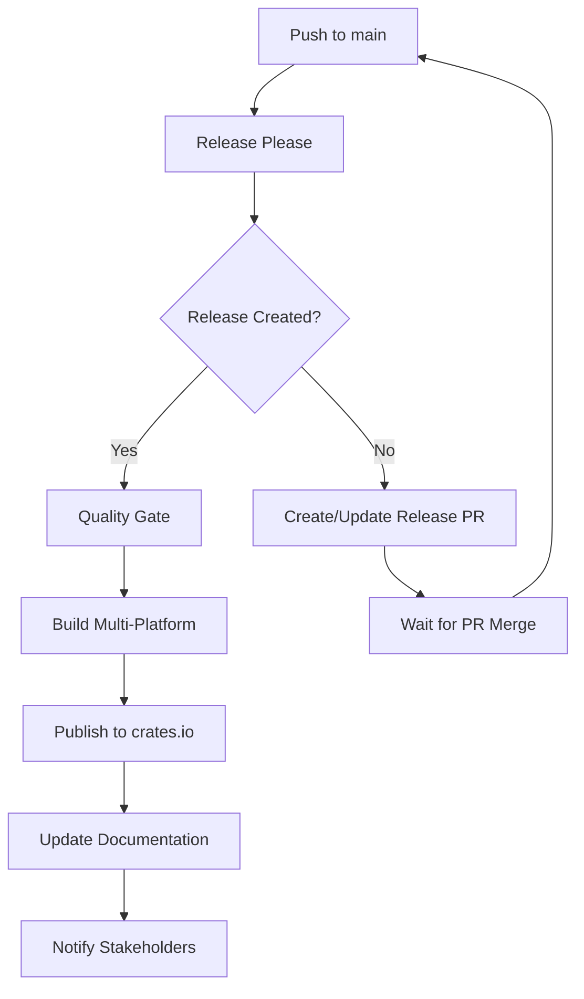

# Release Management Best Practices

## 🚀 Overview

Code-Guardian uses a **fully automated release management system** based on conventional commits and release-please. This ensures consistent, reliable, and professional releases.

## 📋 Table of Contents

1. [Release Workflow](#release-workflow)
2. [Release Types](#release-types)
3. [Version Management](#version-management)
4. [Quality Gates](#quality-gates)
5. [Distribution](#distribution)
6. [Rollback Procedures](#rollback-procedures)
7. [Best Practices](#best-practices)

---

## 🔄 Release Workflow

### **Automated Release Pipeline**



### **Release Stages**

**Stage 1: Release Please (Automated)**
- Analyzes conventional commits since last release
- Determines version bump (major/minor/patch)
- Generates/updates CHANGELOG.md
- Creates release PR or GitHub release

**Stage 2: Quality Gate**
- Code formatting check (`cargo fmt --check`)
- Linting (`cargo clippy -- -D warnings`)
- All tests pass (`cargo test --all-features`)
- Documentation builds (`cargo doc`)
- Security audit (`cargo audit`)

**Stage 3: Multi-Platform Build**
- Linux (GNU + musl)
- Windows (MSVC)
- macOS (Intel + Apple Silicon)
- Archive creation with checksums
- Asset upload to GitHub release

**Stage 4: Distribution**
- Publish to crates.io (dependency order)
- Deploy documentation to GitHub Pages
- Create release summary
- Notify stakeholders

---

## 📊 Release Types

### **Automatic Version Bumping**

Based on conventional commit prefixes:

| Commit Type | Version Bump | Example |
|-------------|--------------|---------|
| `feat:` | **Minor** | `0.1.0` → `0.2.0` |
| `fix:` | **Patch** | `0.1.0` → `0.1.1` |
| `perf:` | **Patch** | `0.1.0` → `0.1.1` |
| `BREAKING CHANGE:` | **Major** | `0.1.0` → `1.0.0` |
| `feat!:` | **Major** | `0.1.0` → `1.0.0` |

### **Manual Release Triggers**

```bash
# Trigger manual release with specific type
gh workflow run release.yml -f release_type=patch
gh workflow run release.yml -f release_type=minor
gh workflow run release.yml -f release_type=major
gh workflow run release.yml -f release_type=prerelease
```

### **Pre-releases**

```bash
# Create pre-release
git commit -m "feat: new feature (pre-release)"
git tag v0.2.0-alpha.1
git push origin v0.2.0-alpha.1
```

---

## 🔢 Version Management

### **Semantic Versioning**

Code-Guardian follows [Semantic Versioning 2.0.0](https://semver.org/):

```
MAJOR.MINOR.PATCH[-PRERELEASE]
```

**Examples:**
- `1.0.0` - Stable release
- `1.1.0` - New features (backward compatible)
- `1.1.1` - Bug fixes
- `2.0.0` - Breaking changes
- `1.2.0-alpha.1` - Pre-release

### **Workspace Version Synchronization**

All crates maintain synchronized versions:
- `crates/core/Cargo.toml`
- `crates/cli/Cargo.toml`
- `crates/output/Cargo.toml`
- `crates/storage/Cargo.toml`

Release-please automatically updates all versions.

---

## 🛡️ Quality Gates

### **Pre-Release Validation**

All releases must pass:

```bash
✅ Code formatting (cargo fmt --check)
✅ Linting (cargo clippy -- -D warnings)
✅ Unit tests (cargo test --all-features)
✅ Documentation tests (cargo test --doc)
✅ Documentation build (cargo doc --all-features)
✅ Security audit (cargo audit)
✅ License compliance (cargo deny check)
```

### **Build Verification**

Multi-platform builds ensure compatibility:
- **Linux**: GNU libc + musl static
- **Windows**: MSVC toolchain
- **macOS**: x86_64 + aarch64 (Universal)

### **Security Validation**

- Dependency vulnerability scanning
- Supply chain security checks
- License compliance verification
- SAST analysis (CodeQL)

---

## 📦 Distribution

### **GitHub Releases**

Each release includes:
- **Source Code**: Automatic GitHub archives
- **Binary Artifacts**: Multi-platform executables
- **Checksums**: SHA256 for all binaries
- **Changelog**: Generated from conventional commits
- **Documentation**: Links to updated docs

### **crates.io Publishing**

Published in dependency order:
1. `code-guardian-core`
2. `code-guardian-storage`
3. `code-guardian-output`
4. `code-guardian-cli`

**Wait times**: 45 seconds between publications for propagation.

### **Documentation Deployment**

- **API Docs**: Deployed to GitHub Pages
- **User Guides**: Available in repository docs/
- **Examples**: Updated with each release

---

## 🔄 Rollback Procedures

### **Emergency Rollback**

**Scenario**: Critical issue discovered in latest release

```bash
# 1. Revert problematic commit
git revert <problematic-commit>
git commit -m "fix: emergency rollback for critical issue"

# 2. Create hotfix release
git push origin main
# This triggers automatic patch release

# 3. Yank problematic crate version (if needed)
cargo yank --vers 1.2.3 code-guardian-cli
```

### **Hotfix Process**

```bash
# 1. Create hotfix branch from latest release tag
git checkout -b hotfix/critical-fix v1.2.3

# 2. Apply minimal fix
git commit -m "fix: critical security issue"

# 3. Create PR to main
gh pr create --base main --title "hotfix: critical fix"

# 4. After merge, release automatically triggers
```

### **Rollback Validation**

After rollback:
- ✅ All CI checks pass
- ✅ Previous functionality restored
- ✅ No new regressions introduced
- ✅ Security issues resolved
- ✅ Users notified of fix

---

## 📋 Best Practices

### **Commit Message Guidelines**

**Good Examples:**
```bash
feat: add support for custom pattern detection
fix: resolve memory leak in file scanner
perf: optimize regex compilation for large files
docs: update API documentation for v2.0
```

**Breaking Changes:**
```bash
feat!: redesign configuration API

BREAKING CHANGE: Configuration format changed from TOML to YAML.
See migration guide in docs/MIGRATION.md
```

### **Release Planning**

**Weekly Schedule:**
- **Monday**: Feature freeze for upcoming release
- **Tuesday-Thursday**: Testing and documentation
- **Friday**: Release (if all quality gates pass)

**Feature Releases (Monthly):**
- Collect features from develop branch
- Comprehensive testing cycle
- Beta release for community feedback
- Stable release after validation

### **Communication**

**Release Announcements:**
- GitHub release notes
- README.md updates
- Documentation deployment
- Community notifications (future: Discord/Slack)

**Security Releases:**
- Immediate notification
- Detailed security advisory
- Upgrade instructions
- Acknowledgments

### **Monitoring**

**Release Health:**
- Download statistics
- Issue reports post-release
- Performance impact analysis
- User feedback collection

**Metrics Tracking:**
- Release frequency
- Time from commit to release
- Quality gate pass rate
- Rollback frequency

---

## 🚨 Emergency Procedures

### **Critical Security Issue**

1. **Immediate Response**:
   ```bash
   # Create security advisory
   gh security advisory create
   
   # Prepare hotfix
   git checkout -b security/cve-fix
   ```

2. **Fix Development**:
   - Minimal code changes
   - Focused on security issue only
   - Comprehensive testing

3. **Emergency Release**:
   - Skip normal release cycle
   - Expedited review process
   - Immediate deployment

4. **Post-Release**:
   - Security advisory publication
   - CVE coordination (if applicable)
   - User notification campaign

### **Build Failure Recovery**

```bash
# If release build fails
gh run list --workflow=release.yml --limit 1
gh run rerun <run-id>

# If persistent failure
git revert HEAD~1
git commit -m "fix: revert problematic release commit"
git push origin main
```

---

## 📚 Additional Resources

### **Tools and Scripts**

- **Release Script**: `scripts/release.sh` (manual backup)
- **Version Checker**: `scripts/check-versions.sh`
- **Changelog Generator**: Automated via release-please

### **Documentation Links**

- [Conventional Commits](https://www.conventionalcommits.org/)
- [Semantic Versioning](https://semver.org/)
- [Release Please](https://github.com/googleapis/release-please)
- [GitHub Releases](https://docs.github.com/en/repositories/releasing-projects-on-github)

### **Monitoring Dashboards**

- GitHub Actions: Workflow status
- crates.io: Download statistics
- GitHub Pages: Documentation deployment
- Security: Vulnerability alerts

---

## 🔄 Continuous Improvement

This release management system is continuously improved based on:

- **Team Feedback**: Developer experience improvements
- **User Feedback**: Release quality and timing
- **Industry Best Practices**: Tool and process updates
- **Security Requirements**: Enhanced protection measures

**Last Updated**: October 2025  
**Next Review**: January 2026

---

*🚀 Efficient, secure, and reliable releases for Code-Guardian!*